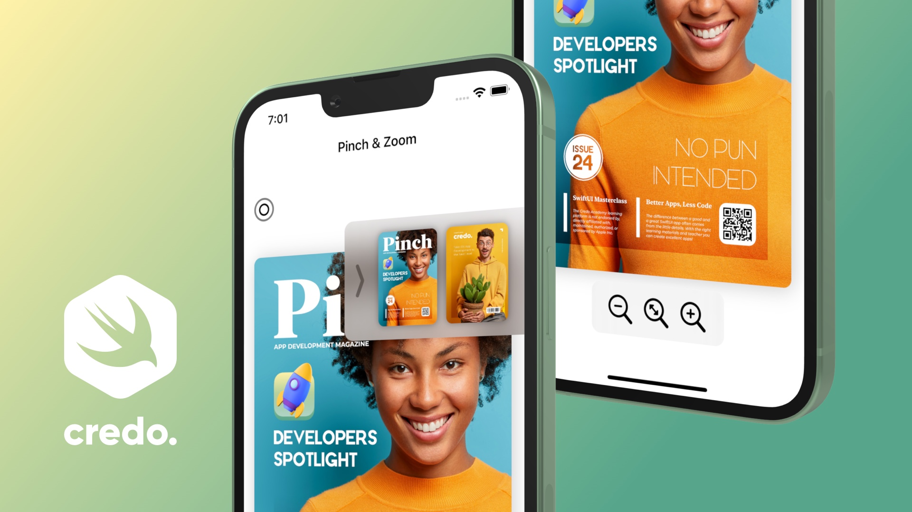
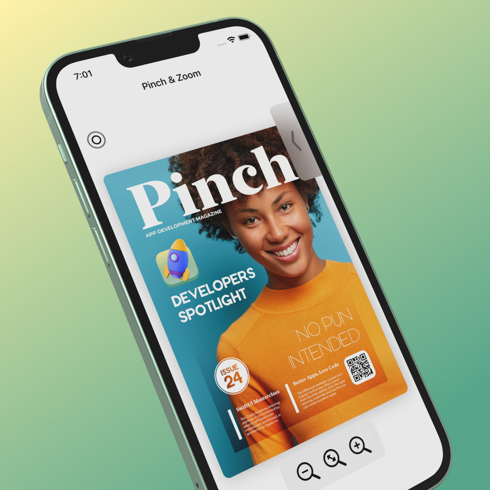
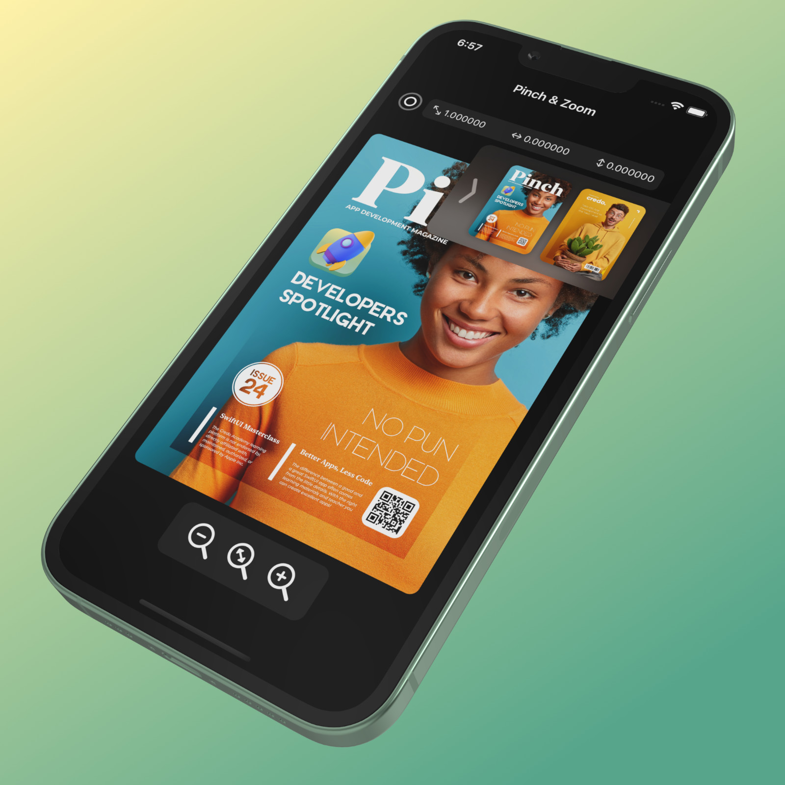
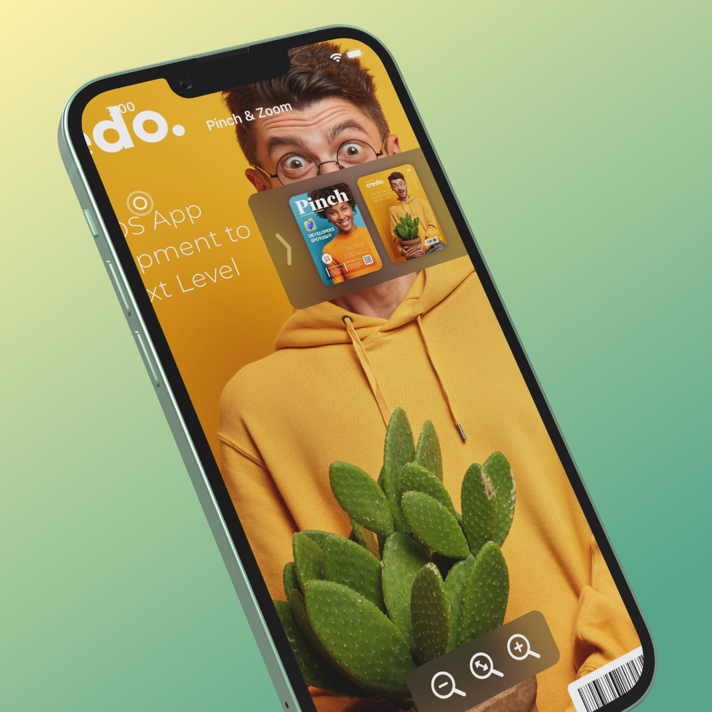
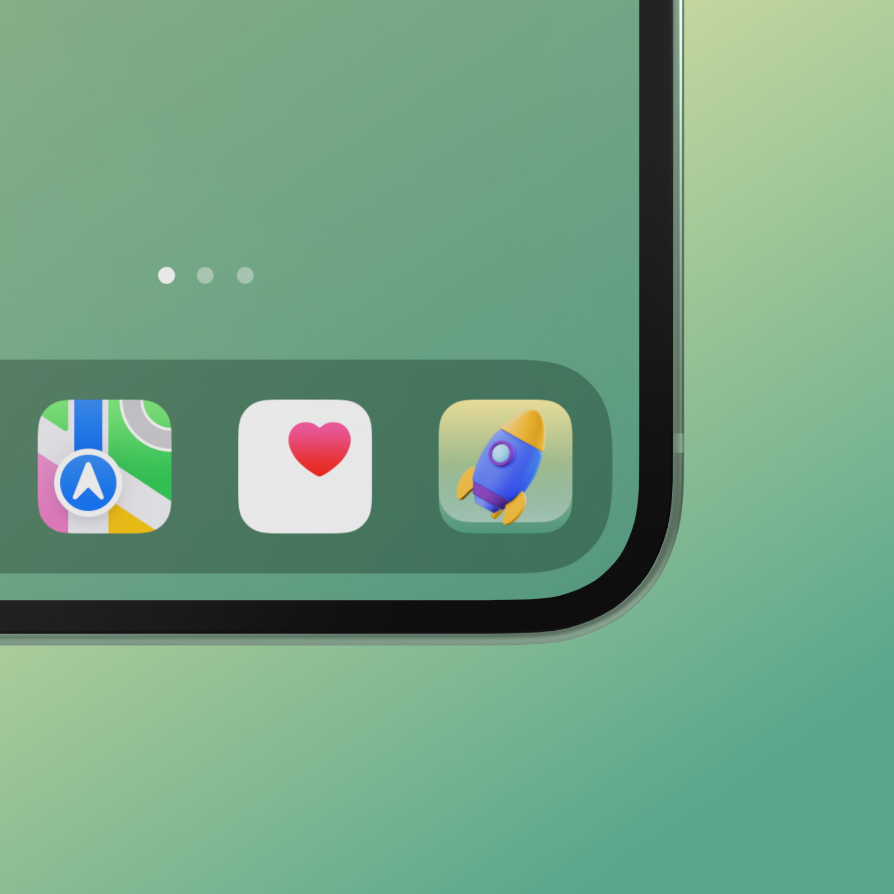

# Pinch

## Main learning objectives of this SwiftUI 3 project

## Pinch & Zoom App

Why should we create this app? Learn how to create advanced Pinch and Zoom features with SwiftUI gestures by developing this fun and engaging iPhone and iPad mobile application in Xcode editor.

## SwiftUI Gestures

The main learning topic of this short and engaging iOS project is to get familiar with almost every SwiftUI gesture such as long-press gesture, double-tap gesture, drag gesture, and magnification gesture (a gesture that recognizes a magnification motion and tracks the amount of it). The only gesture that we will not cover in this tutorial is the rotation gesture.

## SwiftUI Materials

We can apply a blur effect (with color vibrancy) to a view that appears behind another view by adding a material with the background modifier. The new SwiftUI material is not a view, but adding material is like inserting a translucent layer between the modified view and its background.

## SF Symbols

With over 3200 icons, SF Symbols is a library of iconography designed to integrate seamlessly with San Francisco, the system font for Apple platforms. New rendering modes provide greater control over how color is applied to symbols. Besides the standard Single color rendering, there is a Hierarchical rendering, a Palette rendering, and a Multicolor rendering.

## iPhone and iPad App Icon

App Icon makes the first impression on the users' mobile devices. We could not take shortcuts without it if we want to upload our application to Apple's App Store.
